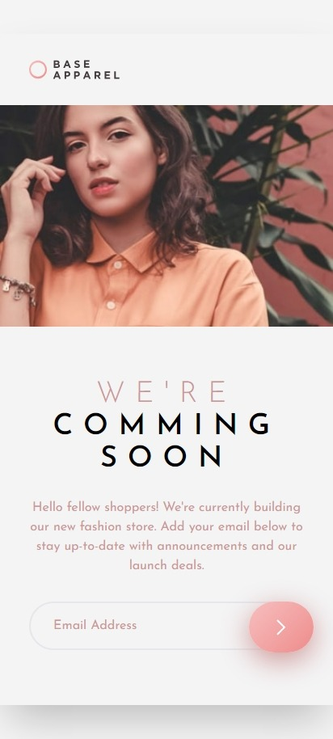
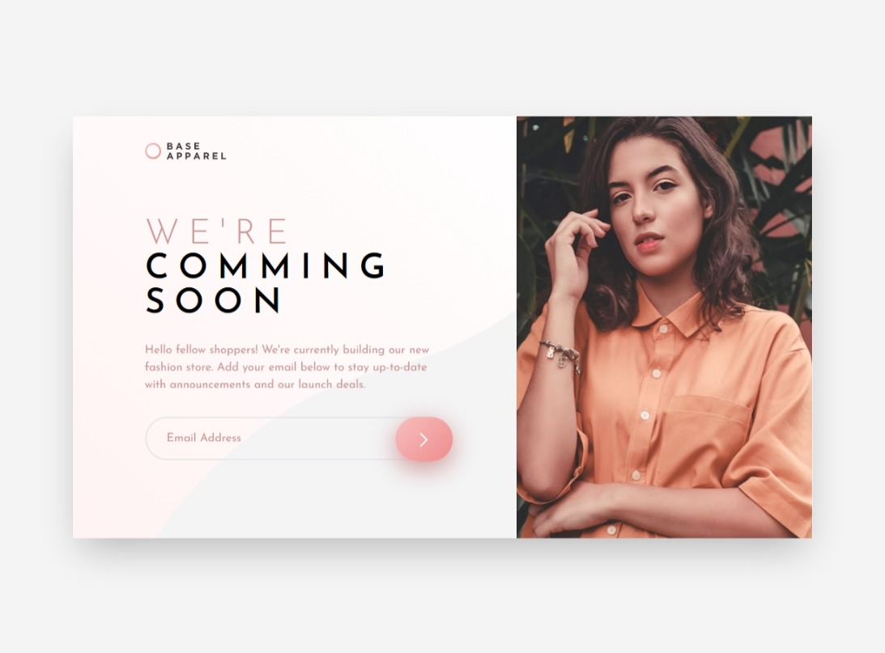

# Frontend Mentor - Base Apparel coming soon page

## Table of contents

- [Overview](#overview)
  - [The challenge](#the-challenge)
  - [Screenshot](#screenshot)
  - [Links](#links)
- [My process](#my-process)
  - [Built with](#built-with)
  - [What I learned](#what-i-learned)
  - [Continued development](#continued-development)
- [Author](#author)

## Overview

### The challenge

Uers should be able to:
- View the optimal layout for the site depending on their device's screen size
- See hover states for all interactive elements on the page
- Receive an error message when the `form` is submitted if:
  - The `input` field is empty
  - The email address is not formatted correctly

### Screenshot

- Mobile:\
\

- Desktop:\
\

### Links

- Solution URL: [Base Apparel coming soon page Solution](https://github.com/kietly2k/practiceprojects/tree/production/coming-soon-page)
- Live Site URL: [Base Apparel coming soon page Live Site](https://kietly2k.github.io/practiceprojects/coming-soon-page/index.html)

## My process

### Built with

- Mobile-first workflow
- Tailwind CSS

### What I learned

- How to use Tailwind CSS to create a simple coming soon page.
- Handle responsive for all screen size using Tailwind CSS.

### Continued development

- Practice more about Tailwind CSS and learn to work with orther front end framework (Vue, ReactJS,...).

## Author

- Github: [Kiet Ly - Fullstack developer](https://github.com/kietly2k)
- Frontend Mentor: [kietly2k](https://www.frontendmentor.io/profile/kietly2k)