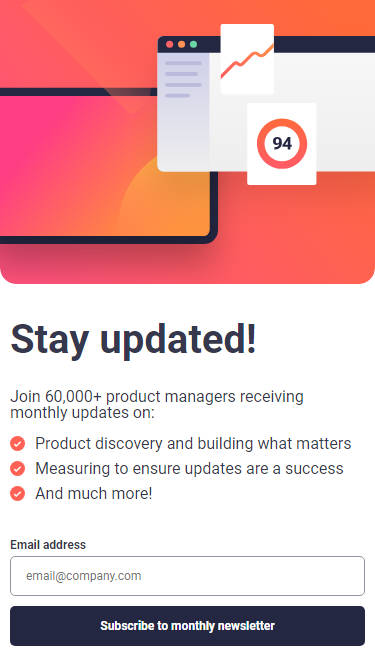
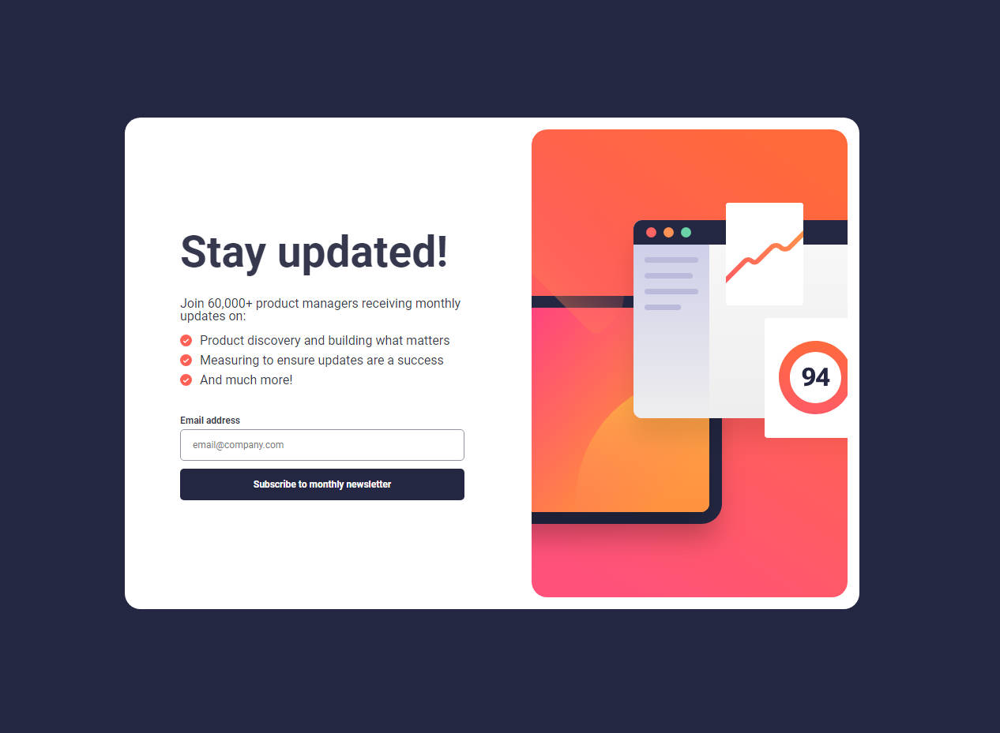

# Frontend Mentor - Newsletter sign-up form with success message

## Table of contents

- [Overview](#overview)
  - [The challenge](#the-challenge)
  - [Screenshot](#screenshot)
  - [Links](#links)
- [My process](#my-process)
  - [Built with](#built-with)
  - [What I learned](#what-i-learned)
  - [Continued development](#continued-development)
  - [Useful resources](#useful-resources)
- [Author](#author)

## Overview

### The challenge

Users should be able to:

- Add their email and submit the form
- See a success message with their email after successfully submitting the form
- See form validation messages if:
  - The field is left empty
  - The email address is not formatted correctly
- View the optimal layout for the interface depending on their device's screen size
- See hover and focus states for all interactive elements on the page

### Screenshot

- Mobile:\
\

- Desktop:\
\

### Links

- Solution URL: [NewsletterFormSolution](https://github.com/kietly2k/PracticeProjects/tree/newsletter/newsletter)
- Live Site URL: [NewsletterFormLiveSite](https://kietly2k.github.io/PracticeProjects/newsletter/index.html)

## My process

### Built with

- Semantic HTML5 markup
- SASS
- Flexbox
- Mobile-first workflow
- Pug
- External animation

### What I learned

- How to use Pug and sass to create a simple newsletter form.
- Handle responsive for all screen size

### Continued development

- Practice more about Sass and Pug.
- Learn about css animation.
- Handle error in JS.

### Useful resources

- [Animista](http://animista.net) - This helped me display a success dialog animation. This website contains various CSS animation codes that are easy to use.

## Author

- Github: [Kiet Ly - Fullstack developer](https://github.com/kietly2k)
- Frontend Mentor: [kietly2k](https://www.frontendmentor.io/profile/kietly2k)
