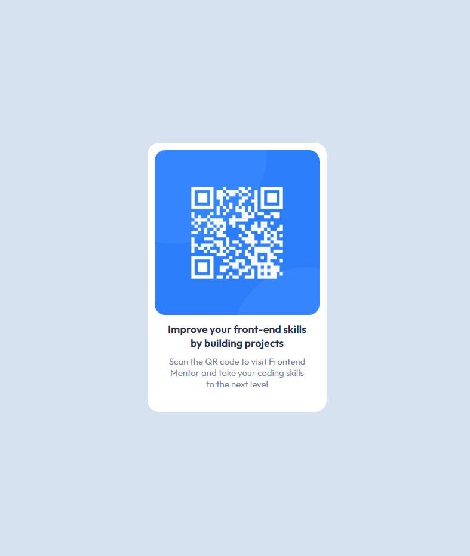

# Frontend Mentor - QR code component solution

This is a solution to the [QR code component challenge on Frontend Mentor](https://www.frontendmentor.io/challenges/qr-code-component-iux_sIO_H). Frontend Mentor challenges help you improve your coding skills by building realistic projects.

## Table of contents

- [Overview](#overview)
  - [Screenshot](#screenshot)
  - [Links](#links)
- [My process](#my-process)
  - [Built with](#built-with)
  - [What I learned](#what-i-learned)
- [Author](#author)

## Overview

### Screenshot



### Links

- Solution URL: [QRCodeSolution](https://github.com/kietly2k/PracticeProjects/blob/qr-code/qr-code/index.html)
- Live Site URL: [QRCodeLiveSite](https://kietly2k.github.io/PracticeProjects/qr-code/index.html)

## My process

### Built with

- Basic HTML5 markup
- Basic CSS syntax
- Flexbox
- Desktop-first workflow

### What I learned

Practice basic concept of css.
How to use reset css and rem unit.
Variable in css.

```css
* {
  box-sizing: border-box;
  margin: 0;
  padding: 0;
}

html {
  font-size: 62.5%;
}

body {
  background-color: var(--clr-Light-gray);
}
```

## Author

- Github: [Kiet Ly - Fullstack developer](https://github.com/kietly2k)
- Frontend Mentor: [kietly2k](https://www.frontendmentor.io/profile/kietly2k)
