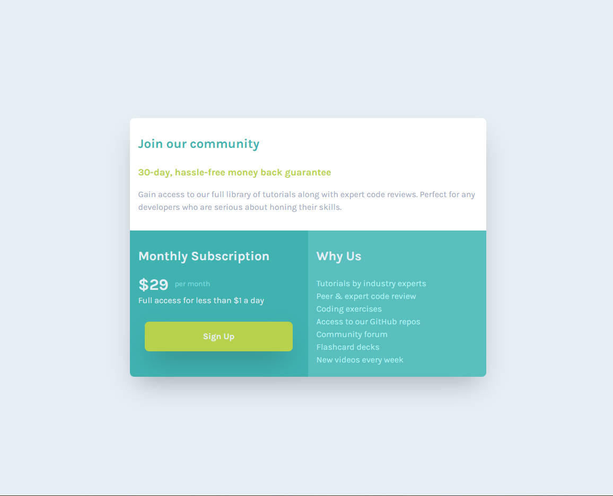

# Frontend Mentor - Single Price Grid Component

## Table of contents

- [Overview](#overview)
  - [The challenge](#the-challenge)
  - [Screenshot](#screenshot)
  - [Links](#links)
- [My process](#my-process)
  - [Built with](#built-with)
  - [What I learned](#what-i-learned)
  - [Continued development](#continued-development)
  - [Useful resources](#useful-resources)
- [Author](#author)

## Overview

### The challenge

Your users should be able to:

- View the optimal layout for the component depending on their device's screen size
- See a hover state on desktop for the Sign Up call-to-action

### Screenshot

- Mobile:\
\

- Desktop:\
\

### Links

- Solution URL: [Single Price Component Solution](https://github.com/kietly2k/practiceprojects/tree/production/single-price)
- Live Site URL: [Single Price Component Live Site](https://kietly2k.github.io/practiceprojects/single-price/index.html)

## My process

### Built with

- Mobile-first workflow
- Tailwind CSS

### What I learned

- How to use Tailwind CSS to create a simple single price component.
- Handle responsive for all screen size using Tailwind CSS.

### Continued development

- Practice more about Tailwind CSS and learn to work with orther front end framework (Vue, ReactJS,...).

### Useful resources

- [Tailwind CSS IntelliSense](https://marketplace.visualstudio.com/items?itemName=bradlc.vscode-tailwindcss)

## Author

- Github: [Kiet Ly - Fullstack developer](https://github.com/kietly2k)
- Frontend Mentor: [kietly2k](https://www.frontendmentor.io/profile/kietly2k)